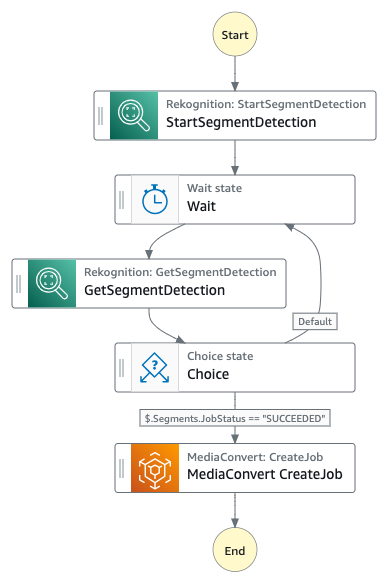
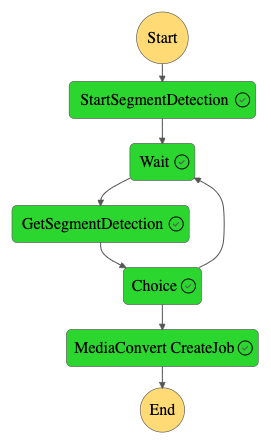

# Segment Detection and Edition

This workflow automates the video edition process by leveraging Amazon Rekognition for detecting segments and Amazon MediaConvert for removing segments.

Learn more about this workflow at Step Functions workflows collection: << Add the live URL here >>

Important: this application uses various AWS services and there are costs associated with these services after the Free Tier usage - please see the [AWS Pricing page](https://aws.amazon.com/pricing/) for details. You are responsible for any AWS costs incurred. No warranty is implied in this example.

## Requirements

* [Create an AWS account](https://portal.aws.amazon.com/gp/aws/developer/registration/index.html) if you do not already have one and log in. The IAM user that you use must have sufficient permissions to make necessary AWS service calls and manage AWS resources.
* [Git Installed](https://git-scm.com/book/en/v2/Getting-Started-Installing-Git)
* [AWS Serverless Application Model](https://docs.aws.amazon.com/serverless-application-model/latest/developerguide/serverless-sam-cli-install.html) (AWS SAM) installed

## Deployment Instructions

1. Create a new directory, navigate to that directory in a terminal and clone the GitHub repository:
    ``` 
    git clone https://github.com/aws-samples/step-functions-workflows-collection
    ```
1. Change directory to the pattern directory:
    ```
    cd step-functions-workflows-collection/segment-detection-workflow
    ```
1. From the command line, use AWS SAM to build and deploy the AWS resources for the workflow as specified in the template.yaml file:
    ```
    sam build
    sam deploy --guided --capabilities CAPABILITY_NAMED_IAM
    ```
1. During the prompts:
    * Enter a stack name
    * Enter the desired AWS Region (some services may only be available in **us-east-1**)
    * Allow SAM CLI to create IAM roles with the required permissions.

    Once you have run `sam deploy --guided` mode once and saved arguments to a configuration file (samconfig.toml), you can use `sam deploy` in future to use these defaults.

1. Note the outputs from the SAM deployment process. These contain the resource names and/or ARNs which are used for testing.

## How it works

Explain how the workflow works.

## Image
Provide an exported .png of the workflow in the `/resources` directory from [Workflow stuio](https://docs.aws.amazon.com/step-functions/latest/dg/workflow-studio.html) and add here.


## Testing

Once your have deployed the statemachine, you should trigger it and see how it in action. For that:

1. Go to the AWS Step Functions console in you AWS Account.

1. Identify the State Machine. You should see a state machine with a name that matches the output of the sam deploy command.

1.  Click on the state machine name and then click **Start Execution** in the top-right of you screen.

1. In the following window, introduce the input of the state machine. It should look like the below json.

    ```json
    {
        "Input": {
            "Bucket": "INPUT_BUCKET_NAME",
            "Key": "INPUT_SOURCE_NAME"
        },
        "Output": {
            "Bucket": "OUTPUT_BUCKET_NAME",
            "Key": "OUTPUT_PREFIX/"
        }
    }
    ```

1. Click on **Start Execution**

1. It will take few minutes, but once the workflow finished, you should see an image like the below.


1. At this point you can go to the Output S3 bucket to see the video edited.

## Cleanup
 
1. Delete the stack
    ```bash
    sam delete
    ```

----
Copyright 2022 Amazon.com, Inc. or its affiliates. All Rights Reserved.

SPDX-License-Identifier: MIT-0
